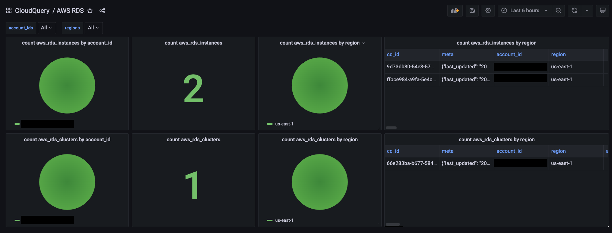

# Grafana Dashboards for CloudQuery

[CloudQuery](https://github.com/cloudquery/cloudquery) is an open-source cloud asset management powered by SQL. Backed by PostgreSQL.

You can connect your CloudQuery PostgreSQL database to Grafana to create a cloud asset inventory that you can visualization, monitoring and alert on.

Also, Checkout our blog about [Building an Open Source Cloud Asset Inventory with CloudQuery and Grafana](https://www.cloudquery.io/blog/open-source-cloud-asset-inventory-with-cloudquery-and-grafana)

## What's inside?

Currently we have basic asset inventory dashboards for AWS, GCP filterable by account_id,regions (project_id for GCP) (more is coming).

**Naming Convention** - Dashboards file name correlate to CloudQuery resources.

### AWS

All AWS dashboards are coming with account_ids and regions filter.

Located under [./dashboards/aws](./dashboards/aws)

### GCP

All GCP dashboards are comming with project_ids filter

Located under [./dashboards/gcp](./dashboards/gcp)

### Examples

Here is an example of AWS RDS asset inventory Grafana dashboard:

Here is an example of AWS EC2 Public and Private Instances Grafana dashboard:

## Contributions

PRs are welcome with news dashboards, also feel free to ask for new dashboards via [GitHub Issues](https://github.com/cloudquery/grafana-dashboards)

